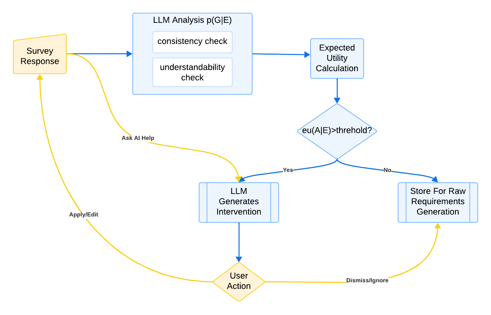
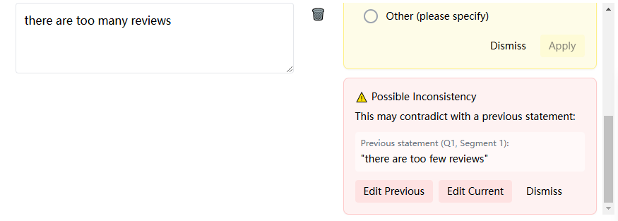
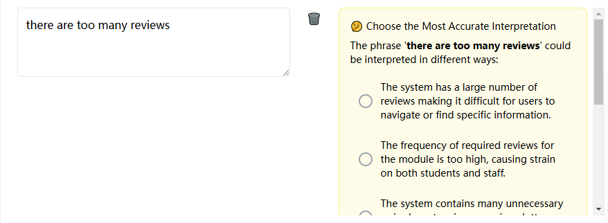

# Mixed-Initiative Requirement Elicitation System

This research project investigates how mixed-initiative interaction can enhance the requirement elicitation process, using AI-powered interventions to support users. Through a systematic study, the system aims to evaluate whether this collaborative approach can improve requirement validability by focusing on understandability and consistency from the client's perspective.

## Project Overview

The system provides an interactive survey environment where users answer questions designed to elicit software requirements. As users provide their answers, the AI system dynamically intervenes when it detects potential issues with understandability or consistency. The goal is to assess whether this mixed-initiative approach helps to improve requirement validability, which will be evaluated by comparing user assessments of requirement quality with and without the system's interventions.



The system processes individual answer segments through parallel LLM analysis for requirement quality issues. Intervention decisions are based on expected utility calculations:

```
eu(A | E) = p(G | E)u(A,G) + [1 - p(G | E)]u(A,¬G)

Where:
- eu(A | E): expected utility of intervening given user response
- p(G | E): probability an intervention is needed given response
- u(A,G): utility of intervening when needed
- u(A,¬G): utility of intervening when not needed
```
### Example Interventions

<div style="display: flex; gap: 10px;">
    
    
</div>

The system provides two main types of interventions:
1. **Understandbility Improvement**: Helps users specify their requirements more clearly when ambiguous phrases are detected
2. **Consistency Checking**: Identifies potential contradictions between different requirement statements

## Models and Technical Implementation

### Understandability Detection
- Implemented using GPT-4
- Leverages established ambiguity types and definitions through crafted prompt templates
- Chosen due to lack of public labeled datasets for requirements ambiguity

### Consistency Detection
- Uses Natural Language Inference (NLI) approach
- Implements nli-deberta-v3-xsmall model
- Evaluates logical relationships between statement pairs (contradiction, entailment, neutral)
- Selected for robust performance on standard NLI benchmarks

## Development Stages

### Current Stage: Data Collection (data-collection branch)
- Forcing interventions at extreme probability points (p(G|E) ≈ 0 and p(G|E) ≈ 1) to collect user feedback and contextual data, enabling inference of utility function for optimal intervention

### Future Stage: System Evaluation
- Implementation of fully integrated system
- Comparative evaluation of MI system versus fixed/no initiative approaches
- Analysis of requirement quality improvements
- User experience assessment

## Getting Started

### Prerequisites
- Node.js
- Python 3.8+
- FastAPI
- React

### Installation
1. Clone the repository
```bash
git clone https://github.com/yuge-camb/MIRE.git
cd MIRE
```

2. Install backend dependencies
```bash
cd backend
pip install -r requirements.txt
```

3. Install frontend dependencies
```bash
cd frontend
npm install
```

4. Start the development servers
```bash
# Backend
cd backend
uvicorn main:app --reload --port 8000

# Frontend
cd frontend
npm run dev
# The terminal will display a local URL - open this in your browser to access the application
```

The terminal will display a local URL - open this in your browser to access the application.

## License

This project is licensed under the MIT License - see the [LICENSE](LICENSE) file for details.

## Acknowledgments

- Research supported by University of Cambridge
- Frontend framework: React with Tailwind CSS
- Backend: FastAPI and Python

## Contact

For questions or collaboration opportunities, please open an issue or contact Yuge Zhang (yz754@cam.ac.uk).

